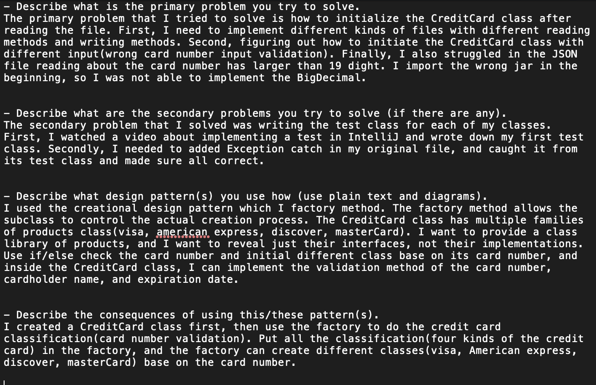
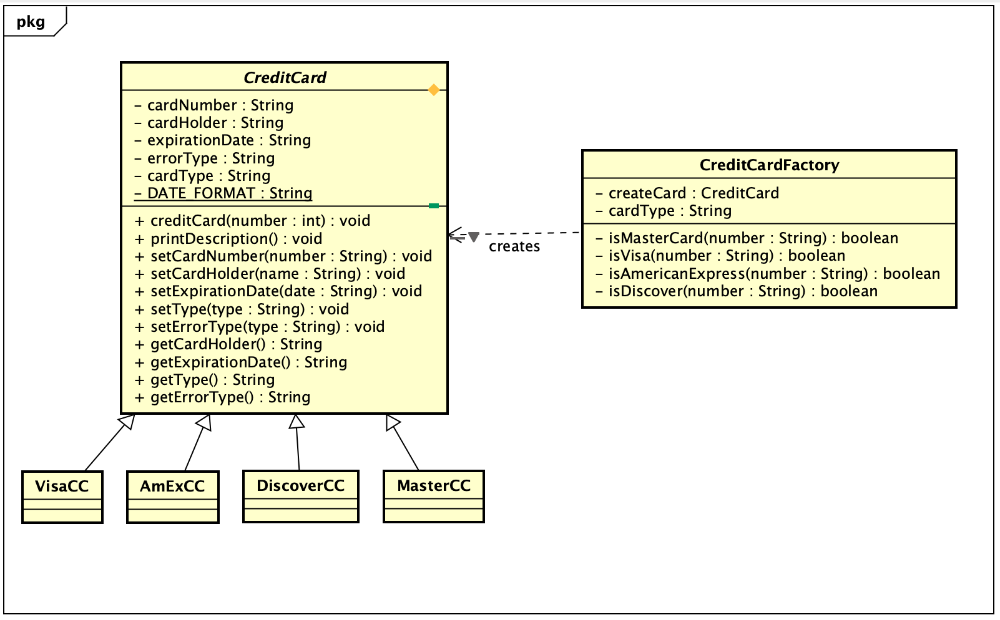
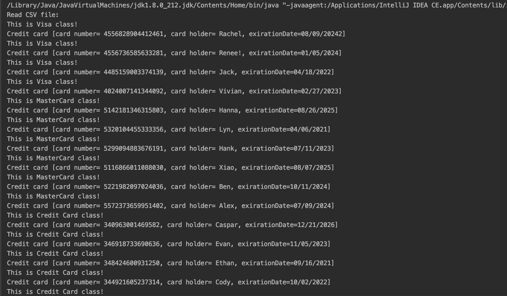
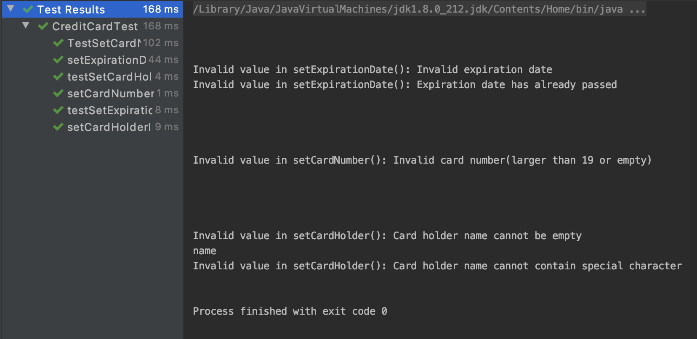
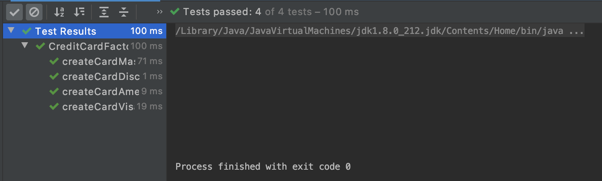
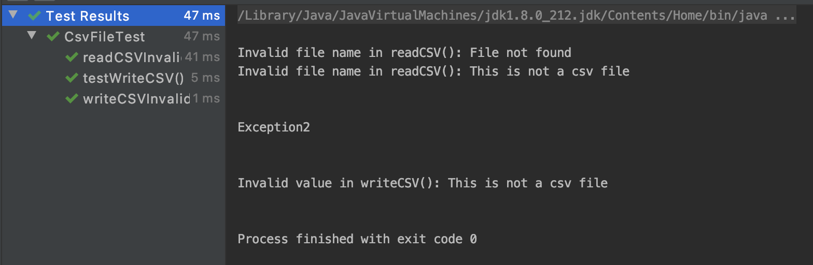
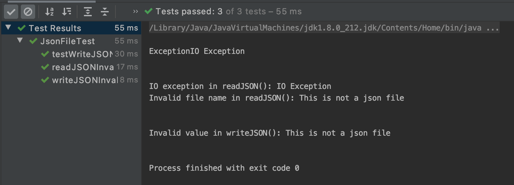
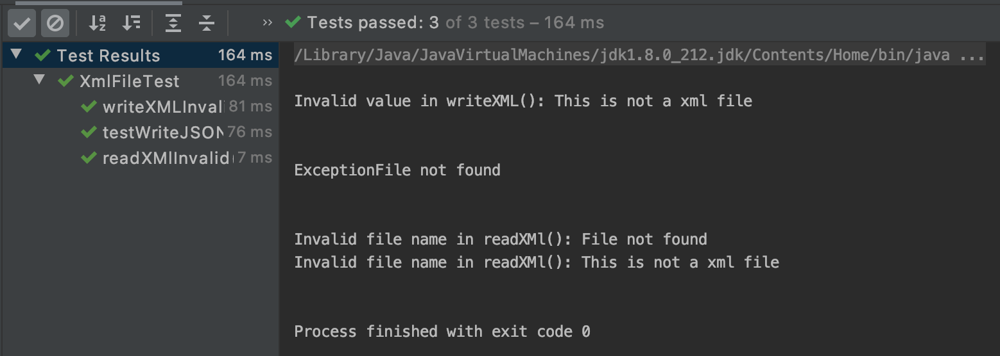

# Individual-Project
## QUESTION ANSWER(PART1):

## UML CLASS DIAGRAM:

## SAMPLE OUTPUT:

## TEST CLASSES OUTPUT:
#### CreditCard Test Class Output:

#### CreditCardFactory Test Class Output:

#### CSV Test Class Output:

#### JSON Test Class Output:

#### XML Test Class Output:

